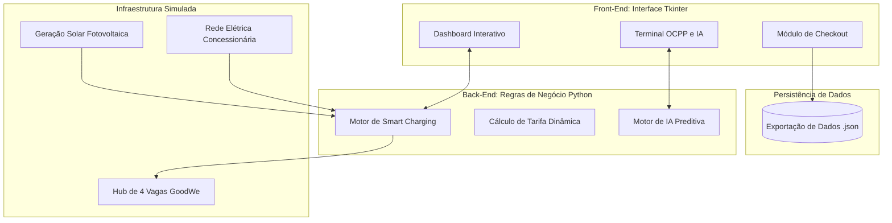
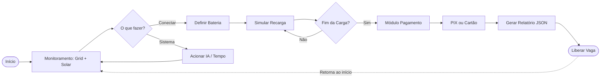

# ⚡ REECHARGE - Hub Inteligente de Recarga VE Integrado à Geração Fotovoltaica

## 👥 Equipe
- **Enzo Posterlli Strinta** - RM570035
- **Giovanna Tristão Lopes** - RM572552

---

## 📖 Sobre o Projeto

Com o crescimento acelerado da frota de Veículos Elétricos (VEs), as redes de distribuição de energia enfrentam um novo desafio: a **sobrecarga da infraestrutura local**. A instalação de múltiplos carregadores em ambientes comerciais pode ultrapassar o limite de demanda contratada da unidade consumidora, gerando pesadas multas e instabilidade na rede.

O **REECHARGE** é uma solução em software que simula o funcionamento de um **Microgrid Inteligente**. O sistema atua como um gerenciador de energia (*Energy Management System - EMS*) para estações de recarga, integrando a rede da concessionária (Grid) com um sistema de **Geração Fotovoltaica (Solar)** local. O objetivo é maximizar o uso de energia renovável, aplicar resposta à demanda (*Demand Response*) e realizar o balanceamento dinâmico de carga (*Smart Charging*)

---

## 🧩 Esquema Detalhado de Integração dos Componentes

### 1. Diagrama de Blocos da Arquitetura (Hardware & Software)

---
### 2. Fluxograma de Operação do Usuário

---

### 3. Protótipo Simulado

* **Tela Inicial**

* **Simulação de Pagamento**

---

## 🛠 Justificativa Técnica das Escolhas
Para atender aos requisitos de automação e integração técnica de forma otimizada e acessível, adotamos as seguintes tecnologias:

* **Integração Solar-Grid:*** Optou-se por somar o limite da demanda contratada (15kW) com a geração fotovoltaica variável (0 a 10kW). Isso justifica-se para mostrar que estações com painéis solares podem oferecer recargas mais rápidas ou atender mais carros simultaneamente sem precisar alterar o contrato com a distribuidora de energia.

* **Linguagem (Python):** Escolhida por sua versatilidade e facilidade na manipulação de estruturas de dados e criação de lógicas complexas de automação.

* **Interface Gráfica (Tkinter):** Utilizamos uma biblioteca nativa do Python. Isso justifica-se para garantir que o software rode em qualquer ambiente sem necessidade de instalações complexas via pip, mantendo o código leve e focado no Pensamento Computacional.

* **Comunicação (Padrão OCPP 1.6J):** O sistema simula mensagens desse protocolo aberto, pois é o padrão global adotado pela indústria (vendors como a GoodWe). Isso torna a lógica de negócio do software compatível com a realidade do mercado.

* **Armazenamento de Dados (JSON):** A persistência de dados de faturamento no formato JSON é o formato universal de troca de informações moderno, facilitando integrações futuras com APIs, bancos de dados NoSQL e Web Dashboards.

* **Design Visual (Preto e Vermelho):** Adotado para conferir um aspecto profissional, tecnológico e de fácil leitura (Dark Mode).
---

## 🌱 Contribuição para Sustentabilidade, Automação Inteligente e Eficiência Energética

O projeto foi arquitetado para que cada tecnologia aplicada atue diretamente nos três pilares exigidos para a infraestrutura moderna de cidades inteligentes:

### 1. Sustentabilidade (Integração Fotovoltaica Simulada)
* **Tecnologia:** Lógica de injeção de energia renovável baseada em horário (Simulação de Inversores Híbridos).
* **Contribuição:** O sistema reduz a dependência de combustíveis fósseis e da rede elétrica convencional ao priorizar a energia solar. Ao detectar alta geração (ex: entre 10h e 14h), a plataforma orienta o consumo de energia limpa, reduzindo a pegada de carbono da operação do hub de recarga.

### 2. Automação Inteligente (Motor Python e IA Preditiva)
* **Tecnologia:** Algoritmos em Python e Processamento de Regras Preditivas.
* **Contribuição:** O sistema elimina a necessidade de microgerenciamento humano. A automação inteligente monitora em tempo real a ocupação das vagas, a tarifa do momento (Demand Response) e a geração solar. Além disso, o Agente de IA toma decisões de negócio de forma autônoma, sugerindo ao operador aplicar tarifas promocionais ou alertando sobre sobrecargas iminentes antes que elas afetem a infraestrutura.

### 3. Eficiência Energética (Smart Charging e OCPP 1.6J)
* **Tecnologia:** Algoritmo de *Load Balancing* (Balanceamento de Carga) e mensagens do padrão OCPP.
* **Contribuição:** A eficiência energética é garantida pelo *Smart Charging*. Em vez de sobrecarregar a rede ou precisar de cabos e transformadores superdimensionados (o que seria caro e ineficiente), o algoritmo divide dinamicamente a potência exata disponível (Rede + Solar) entre os veículos conectados. Isso garante que nenhum watt seja desperdiçado e que o limite contratado da distribuidora de energia nunca seja estourado, garantindo máxima eficiência com os recursos físicos disponíveis.
---

## 📊 Resultados e Dados Funcionais Apresentados
O protótipo simulado entrega, em tempo real, os seguintes resultados funcionais operacionais:

* **Smart Charging em Ação:** Se a capacidade somada de recarga dos carros exceder o limite do Hub (Grid 15kW + Solar Variável), o sistema restringe automaticamente a potência enviada (Ex: reduz de 7kW para 3.5kW por vaga), evitando multas na conta de luz comercial.

* **Uso de Energia Limpa:** O sistema reconhece a "hora do dia" e simula a entrada de energia solar, diminuindo a dependência da rede local.

* **Módulo de Pagamento Funcional:** O operador calcula o custo real da recarga considerando Tarifas de Pico (acréscimo de 30% entre 18h e 21h) e efetua "baixa" via PIX ou Cartão.

* **Coleta de Dados:** O encerramento das vagas gera automaticamente o arquivo físico "relatorio_financeiro_[DATA].json" contendo ID da vaga, energia consumida, valor pago e forma de pagamento.

* **Variação da Matriz de Suprimento:** O usuário visualiza o relógio avançar e a geração solar subir e descer, alterando diretamente a potência máxima do hub em tempo real.

* **Rateio de Potência (Gargalo Físico):** A simulação prova que conectar múltiplos VEs não causa colapso (Blackout local), mas sim uma desaceleração controlada da recarga, mantendo a operação segura e dentro da norma técnica.

* **Métricas Financeiras Atreladas à Energia:** O sistema exporta faturas (.json) relacionando a quantidade exata de energia consumida (kWh) com o custo do horário da tomada, evidenciando o modelo de negócios viável de um eletroposto sustentável.
--- 

## 🧠 Conexão com os Conteúdos da Disciplina
Este projeto engloba de forma prática os pilares da disciplina:
* **Geração Distribuída (GD):** A infraestrutura atua como mini-geradora local.

* **Mitigação da Intermitência Renovável:** A IA entra em cena para casar o consumo dos carros com a variabilidade do sol (quando não há sol, o carregamento é desacelerado para não forçar o limite da rede).

* **Gestão pelo Lado da Demanda (GLD):** Alteramos o comportamento do consumidor e da máquina com precificação, moldando a curva de consumo da unidade para torná-la mais eficiente energeticamente.

---

## ⚙️ Estrutura do Repositório e Instruções de Funcionamento
### Arquivos no Repositório:
* codigo.py: Código-fonte principal com a Interface Gráfica e regras de negócio.

* readme.md: Documentação atual do projeto.

### Como Executar a Aplicação:
1. Certifique-se de ter o Python 3.8 ou superior instalado em sua máquina.

2. Clone o repositório ou faça o download do arquivo app_gui.py.

3. Abra o terminal na pasta onde o arquivo está salvo.

4. Execute o comando: codigo.py

5. Interaja com a interface gráfica, crie sessões, teste o módulo de pagamento e verifique o arquivo .json gerado ao final das operações na mesma pasta do executável.
